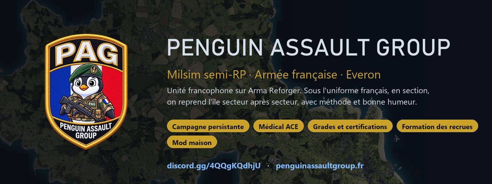
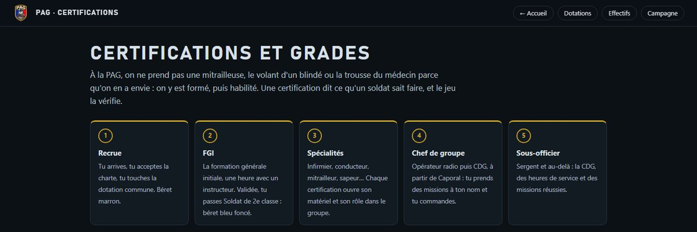
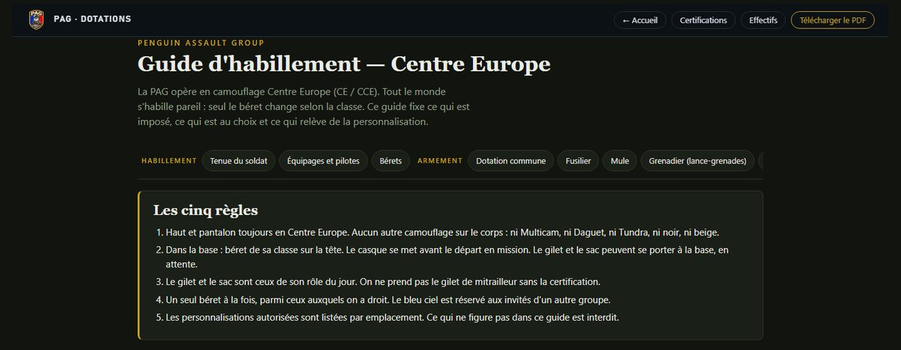
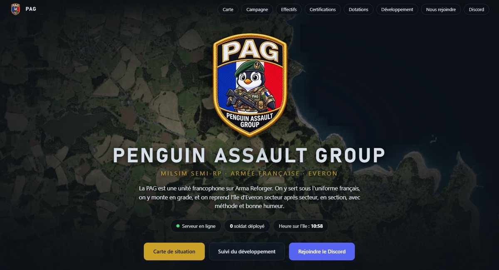
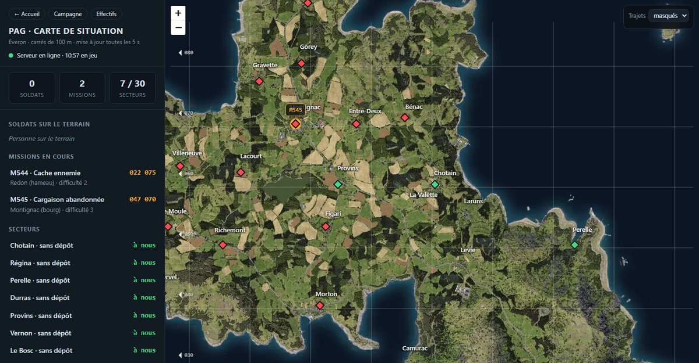
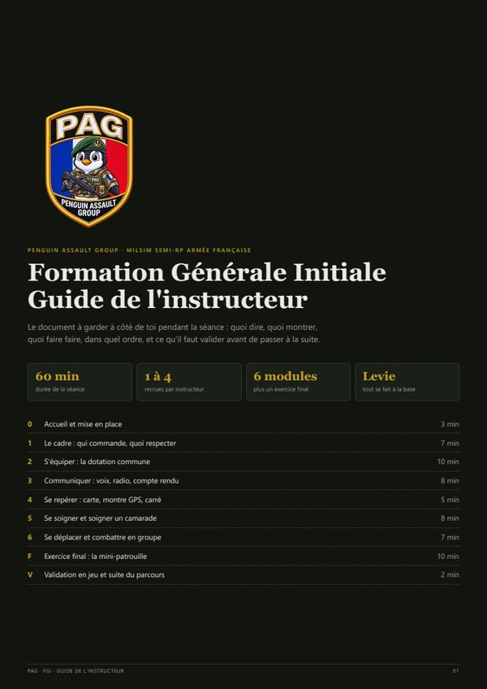
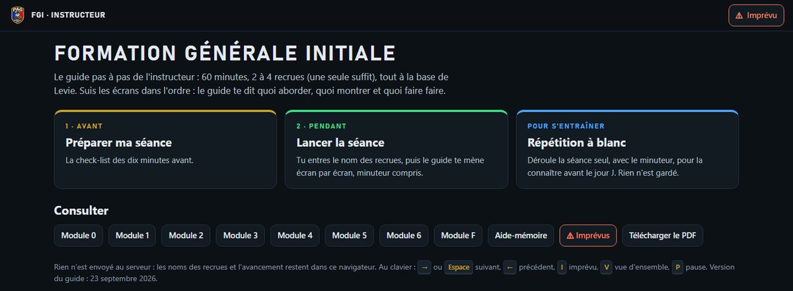
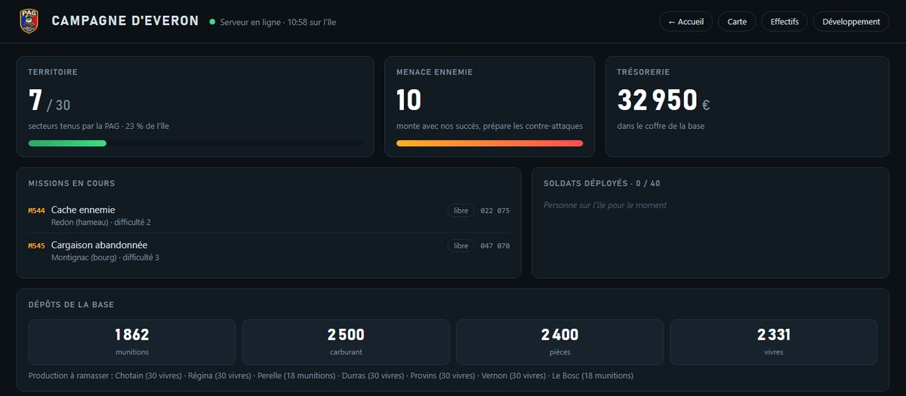
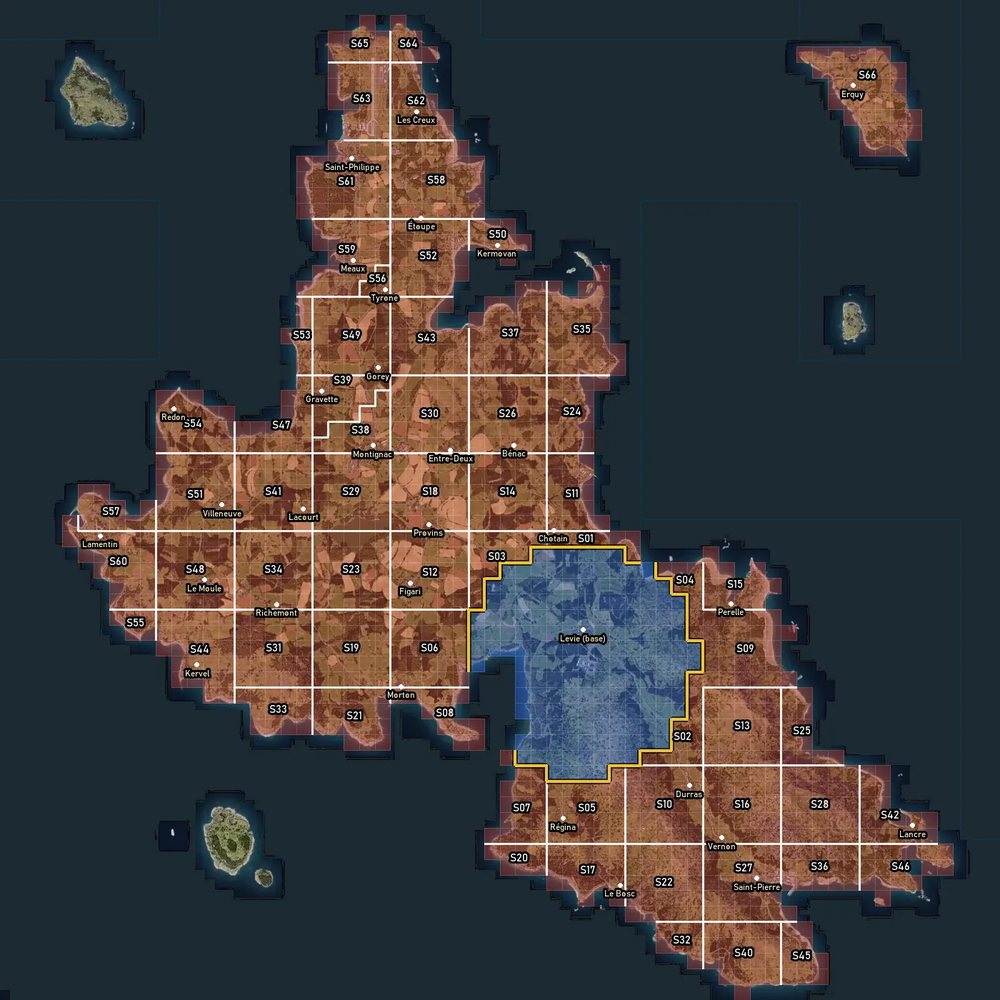
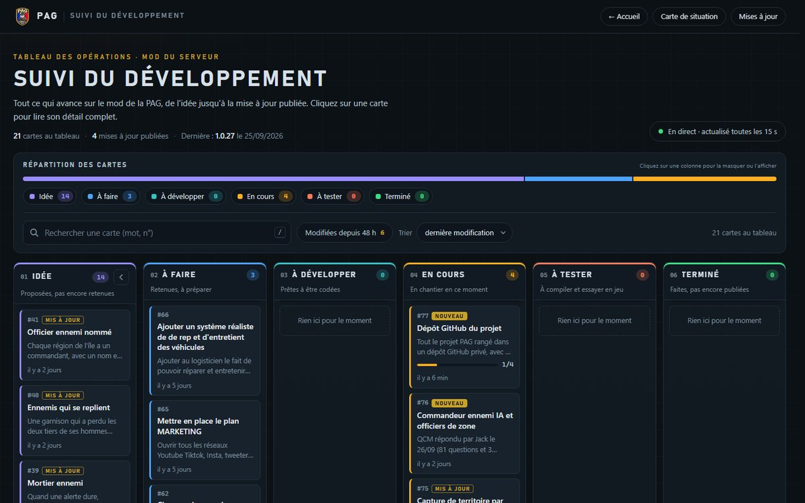

# PAG | Penguin Assault Group



Tout ce qui fait tourner le serveur milsim de la PAG sur Arma Reforger : le mod maison SimpleRP, le bot Discord, le site public, la carte de situation, le tableau de suivi, les guides de formation et les outils.

> **EN** — PAG (Penguin Assault Group) is a French-speaking "milsim semi-RP" group on Arma Reforger. Players serve in the French Army on the island of Everon, from a base at Levie, against a Russian enemy played by the AI. This repository holds the SimpleRP server mod (Enforce Script, 72 scripts), the Discord bot that also serves the public website, the live situation map and the development board, the recruit training (FGI) and loadout guides, and a set of Python tools. All documentation is in French. The code is published so that it can be read and studied; all rights reserved (see below).

Le code est publié pour être lu, étudié et servir d'exemple à d'autres groupes. Pour rejoindre la PAG : le [site](https://penguinassaultgroup.fr) et son Discord. Conditions de réutilisation : voir [Crédits et droits](#crédits-et-droits).

## Sommaire

- [L'idée](#lidée)
- [Le projet en un coup d'œil](#le-projet-en-un-coup-dœil)
- [Comment ça fonctionne](#comment-ça-fonctionne)
- [Organisation du dépôt](#organisation-du-dépôt)
- [Installer et lancer](#installer-et-lancer)
- [Ce qui n'est pas dans le dépôt](#ce-qui-nest-pas-dans-le-dépôt)
- [Avancement et historique](#avancement-et-historique)
- [Crédits et droits](#crédits-et-droits)

---

## L'idée

La PAG est un groupe francophone de jeu militaire en équipe (« milsim semi-RP ») sur **Arma Reforger**.

- On sert dans l'**armée française** sur l'île d'**Everon**. La base est à **Levie**.
- L'ennemi est l'armée russe (mod RHS: Status Quo), **jouée par l'IA**. Le serveur accueille 40 joueurs.
- La campagne est **persistante** : territoire, argent, véhicules, stocks et fiches de soldat restent d'une soirée à l'autre.

**L'esprit : sérieux, mais accessible.**

- Une chaîne de commandement, dix grades et quinze certifications.
- Une charte de dix règles, acceptée en jeu à la première connexion. Devise : « Serrés, on tient. »
- Les débutants sont formés. La **FGI** (Formation Générale Initiale) est une séance d'une heure donnée par un instructeur. Elle fait passer de Recrue à Soldat de 2e classe.
- Les ordres passent par le commandement : on prend ses missions au tableau de la base, un officier les accorde ou les ordonne.

**Pourquoi un mod maison ?** Le mode Conflict du jeu ne gère ni les grades qui suivent le joueur, ni une économie de base, ni des missions données par le commandement, ni un ennemi dosé selon les joueurs présents. SimpleRP est donc un mode de jeu à part, **sans dépendance à Conflict**. Il relie des mods existants (AMF pour l'armée française, RHS pour l'ennemi, ACE pour le médical, Bacon Loadout Editor pour l'arsenal, CRX pour le comportement de l'IA) et ajoute les règles de la PAG. Autour du jeu, le Discord et le site montrent ce qui se passe sur le serveur.

| Les certifications et les grades | Le guide d'habillement et les dotations |
|---|---|
|  |  |

---

## Le projet en un coup d'œil

| Brique | Rôle | Dossier |
|---|---|---|
| Mod SimpleRP | Mode de jeu du serveur (addon Workbench « PAG - Penguin Assault Group ») : 72 scripts Enforce, environ 91 900 lignes | `mod/SimpleRP/` |
| Profil du serveur | Modèle de la charte, réglages du front et du Commandeur (modifiables sans republier le mod) | `mod/profil-serveur/` |
| Serveur de jeu | Listes des mods à charger | `outils/serveur/` |
| Bot Discord (PAG-Bot) | Commandes slash, alertes, rôles, pont avec le jeu, serveur des pages web. Python : discord.py, aiohttp, Pillow | `bot/` |
| Site public | Accueil, Campagne, Effectifs, fiches de soldat, Certifications, Dotations, guide de l'instructeur | `bot/site_web/` |
| Carte de situation | Carte web en direct (Leaflet), carrés de 100 m, trajets, front | `bot/carte/` |
| Tableau de suivi | « Trello maison » à 6 colonnes et historique des versions | `bot/suivi.py`, `bot/suivi_cli.py`, `bot/suivi_web/` |
| FGI | Une source JSON qui produit le PDF de l'instructeur, la page web et le plan Markdown | `outils/fgi/`, `docs/Plan_FGI_v2.md` |
| Tenues et dotations | Guide d'habillement, bérets, armement par certification, nettoyage de l'arsenal | `outils/tenues/` |
| Traduction ACE | 170 textes français des mods ACE Dev, en surcharge dans le mod | `outils/ace-fr/` |
| Installation du Discord | Rôles, salons, permissions et webhooks créés par l'API | `outils/discord-installation/` |
| Contrôle Enforce | Vérification statique du code du mod avant compilation | `outils/verif-enforce/` |
| Documentation | Guide du mod, commandes, plans, analyses, conception du front, maquettes | `docs/` |

| Le site d'accueil | La carte de situation |
|---|---|
|  |  |

---

## Comment ça fonctionne

### Une soirée type, côté joueur

1. **Connexion.** Le serveur lit l'identité Bohemia du joueur et charge (ou crée) sa fiche. Un joueur banni est expulsé.
2. **Charte.** L'écran s'ouvre tant que la version en cours n'est pas acceptée. Sans acceptation, le joueur est ramené au point d'apparition s'il s'en éloigne de plus de 50 m (il ne peut donc pas quitter la base), et l'écran se rouvre.
3. **Apparition à Levie** avec un kit de dotation gratuit. À la reconnexion, il reprend sa position et son inventaire.
4. **FGI.** Une recrue suit la formation (60 min, 2 à 4 recrues). L'instructeur la valide par l'action « Gestion du soldat » : elle devient Soldat de 2e classe, et son rôle Discord suit si son compte est lié.
5. **Équipement** à l'arsenal. Les munitions sont payées en paquets pris dans la soute de la base.
6. **Mission.** Un chef de groupe prend une mission au tableau, ou un officier en ordonne une (en jeu ou depuis Discord).
7. **Terrain.** Garde ennemie, renforts en camion, civils, parfois un hélicoptère de recherche ou un contrôle routier.
8. **Retour.** Le butin est déposé au coffre et les caisses de récompense arrivent à la base. La mission réussie est comptée automatiquement à chaque joueur vu sur le site (réglage `m_bAutoCountMissions`, coché dans le mode de jeu). Les officiers peuvent corriger les états de service par « Gestion du soldat ».
9. **Mort.** Réapparition au bout de 10 s, pour 2 paquets de vivres (60 s si l'intendance est vide).

Touches du mod : **F8** bouchons d'oreilles, **F9** portée de voix, **F10** menu Staff, **F** au contact des objets de la base. Commandes du chat : `/aide`, `/mp`, `/lier`, `/vote`, `/charte`, `/admin`.

### Grades et certifications

| Grade | Conditions par défaut |
|---|---|
| Recrue | arrivée |
| Soldat de 2e classe | FGI |
| Soldat de 1re classe | FGI, 10 h de jeu, 8 missions |
| Caporal | FGI, 25 h, 20 missions |
| Caporal-chef | FGI, 50 h, 40 missions |
| Sergent | FGI + CDG, 100 h, 70 missions |
| Sergent-chef | FGI + CDG, 200 h, 120 missions |
| Adjudant | FGI + CDG, 400 h, 200 missions |
| Lieutenant, Capitaine | sur nomination |

- Une promotion est une **décision d'officier**, jamais au-dessus de son propre grade.
- Les conditions par défaut sont écrites dans le code (`Scripts/Game/SimpleRP/SRP_Definitions.c`). `Configs/SimpleRP/SRP_CertifTree.conf` reprend les mêmes valeurs mais **n'est pas branché** : pour s'en servir, l'enregistrer dans le Workbench (création du `.meta`), puis le choisir dans « Arbre des certifications » du composant `SRP_PlayerManagerComponent` de `SRP_GameMode.et`.
- **15 certifications** : FGI, opérateur radio, infirmier, médecin, sapeur, logisticien, VL, PL, blindé, pilote, mitrailleur, lance-grenades, antichar, tireur de précision, chef de groupe (CDG). Certaines en demandent d'autres (PL exige VL, CDG exige opérateur radio et Caporal, etc.).
- Chaque certification est délivrée par un **instructeur habilité** pour elle, lui-même habilité par un Adjudant ou le Staff.
- **Verrou souple** : prendre un véhicule ou un matériel sans la certification est possible, mais c'est inscrit au journal et les officiers sont prévenus.
- Le mod n'affiche à chacun que les actions qu'il a le droit de faire.

**La FGI** se donne avec un guide de l'instructeur, en PDF et en page web (`/instructeur/`), produits par [outils/fgi/](outils/fgi/) à partir d'une seule source JSON.

| Le guide de l'instructeur (PDF) | La page web de l'instructeur |
|---|---|
|  |  |

### Les grands systèmes du mod

| Système | En bref |
|---|---|
| Missions | 17 types (cache ennemie, convoi, poste d'observation, sabotage, officier ennemi, zone minée, documents, écoute radio, ravitaillement largué, capture de zone, contrôle routier…). Deux missions automatiques en permanence, « Trouver une mission » au tableau, mission ordonnée par un officier, demande au commandement traitée sur Discord. Récompense : 1 500 € × difficulté (1 à 3) au coffre et 20 paquets × difficulté. |
| Économie | Coffre commun en euros (10 000 € au premier lancement, réglage `m_iInitialBalance` du mode de jeu). L'argent n'est pas un objet : un ennemi tué laisse une sacoche une fois sur deux (50 à 300 €), à déposer au coffre. Un civil tué coûte une amende de 1 000 € à la base. Le terminal logistique vend des véhicules (de 4 000 € pour un GBC 180 à 80 000 € pour un NH90 Caïman) et des paquets. |
| Logistique | Quatre ressources en paquets physiques d'un kilo : munitions, carburant, pièces, vivres. Quatre dépôts à la base (Soute, Citerne, Atelier, Intendance). Consommation : 2 vivres par joueur et par heure, 2 par réapparition. Les commandes arrivent sur des points de livraison éloignés, parfois tenus par l'ennemi. |
| Arsenal | Bacon Loadout Editor. Armes et médical gratuits ; 1 paquet de munitions par chargeur, 5 par roquette, 2 par grenade ; retour à l'arsenal remboursé. |
| Parc de véhicules | Parc persistant (position, carburant, dégâts, cargaison). Balises GPS, plein à la citerne, réparation à l'atelier payée en pièces. Un véhicule détruit est perdu. |
| Médical | Médical ACE (circulation, respiration, zones de dégâts). Poste de secours à la base. |
| Voix et radio | F9 : chuchoté 5 m, normal 30 m, fort 68 m. Radios à portée illimitée avec la clé de la faction. F8 : bouchons d'oreilles (−30, −60, −90 %). |
| Ennemi IA | Soldats RHS (AFRF) réglés avec CRX. Effectif au prorata des joueurs **proches** (un groupe par tranche de 2 joueurs à moins de 3 km), jamais posé à moins de 1 500 m de la base ni à la vue des joueurs. Perception maison (posture, nuit, lampe, tirs, buisson). Alerte, aide par le flanc, ratissage, fusées éclairantes la nuit. Garnisons de 10 (hameau), 20 (village) et 30 soldats (ville), plus 3 par joueur au-delà de 2, plafond de 60. Camions Ural de renfort, sirène d'alerte destructible. Dispersion du tir ×0,7. |
| Hélicoptère de recherche | Mi-8 RHS à vol scripté, projecteur la nuit. Se cacher sous le feuillage marche. Sans le Commandeur (1.0.27) : sortie sur alerte, 10 % le jour, 25 % la nuit, +15 points par tirage raté (70 % au plus). Avec le Commandeur (code actuel) : plus de tirage, sortie seulement sur son ordre, 3 sorties en stock, 30 min de repos entre deux sorties. |
| Civils | Une zone par localité, 25 civils au plus, voitures sur les routes, réflexes de danger (fuite, plongeon). Aucun civil à moins de 300 m de la base. |
| Contrôle routier | Un soldat l'établit sur une route (2 soldats présents, carré ami, à 1 000 m au moins de la base). Tenir 20 min ; un conducteur sur cinq est suspect. Papiers, fouille, arrestation (serflex ACE), désamorçage par un sapeur. Primes : 750 € par saisie, 400 € par arrestation, −750 € par suspect passé. |
| Brèche de porte | Une charge Hexomax ou un pétard de tolite qui explose collé à une porte (environ 1 m) la fait disparaître pour tous, jusqu'au redémarrage. |
| Jour et nuit, base | Une journée dure 3 h réelles ; l'heure est sauvegardée. Un générateur alimente les lampes à moins de 300 m de la base ; détruit, la base est dans le noir jusqu'à réparation. |
| Déconnexion | Le corps reste 15 min. Tué pendant ce temps, le joueur est mort. |
| PC et tableau | L'ordinateur du poste de commandement a des onglets Effectifs, Ma fiche, Instructeurs, Missions, Territoire, Journal, Base, Officiers. Les écrans sont jouables à la manette. |
| Staff et journal | Menu Staff (F10) à onglets : Rapide, Joueurs, Missions, Territoire, Commandeur, Logistique, Serveur, Danger. Chaque action est vérifiée par le serveur et journalisée. Journal mensuel horodaté, bannissements persistants. |



*La page Campagne du site montre en direct le territoire, la menace, le coffre, les missions en cours et les stocks de la base.*

Toutes les données vivent en JSON ou en texte dans le dossier profil du serveur (`$profile:SimpleRP/`, c'est-à-dire `<dossier donné par -profile>/SimpleRP/`). Les valeurs se règlent sur les composants du mode de jeu `Prefabs/MP/Modes/Plain/SRP_GameMode.et` (catégories « SimpleRP - … » dans le Workbench).

### Le front par carrés et le Commandeur ennemi (en essai)



Ce chantier (cartes #75 et #76 du tableau) remplace l'ancien territoire par secteurs. Il est **codé et compilé, pas encore publié**.

**Le front**

- L'île est découpée en **carrés de 200 m** (1 399 carrés en jeu, une fois retirés 6 îlots sans localité), regroupés en **66 zones** plus la base de Levie. 30 zones ont une localité.
- Un carré se prend quand des joueurs y sont, sans ennemi en état de combattre, et qu'il touche un carré ami. La durée est un réglage : 1 min (choix de Jack du 27/09, en essai). Les villes et villages se prennent par blocs (600 m autour du centre, 5 min).
- Chaque localité a un **point clé** (son centre) ; une ville peut avoir en plus un QG, s'il est posé au Workbench (aucun ne l'est encore). Saisir un point clé, c'est prendre son poste de commandement ennemi (60 s, aucun ennemi à 100 m). Un mât tricolore le remplace.
- Une zone tombe quand ses points clés sont saisis et qu'au moins 50 % de ses carrés sont à nous. La **menace** de l'île (0 à 10) monte alors de 1.
- L'ennemi reprend du terrain par des **contre-attaques** annoncées (toutes les 180 min à menace 0, toutes les 60 min à menace 10, seulement avec au moins 4 joueurs connectés). Deux exceptions : une zone coupée de la base pendant 24 h, et une offensive de nuit quand le serveur est vide.
- Une zone à nous produit des vivres ou des munitions, à ramasser dans un dépôt de zone.

**Le Commandeur ennemi**

- Un état-major hors carte qui ne sait que ce que ses soldats voient ou entendent (positions floutées, contacts oubliés après 20 min). Des civils peuvent servir d'informateurs.
- **6 officiers de région** (R1 Durras à R6 Saint-Philippe), chacun avec un caractère et une cachette qui change chaque jour. Tué, sa région est désorganisée 3 h ; capturé, 6 h.
- Des **stocks** limités : 48 obus de mortier, 2 blindés, 3 sorties d'hélicoptère, 1 tir d'artillerie lourde, 1 bombe par 24 h. Aucune frappe à moins de 1 500 m de la base.
- 120 soldats ennemis au sol au plus.

**Réglages** : `front_reglages.txt`, `commandeur_reglages.txt` et `front_retouches.txt` dans `$profile:SimpleRP/` (exemples dans `mod/profil-serveur/`, voir [Profil du serveur](#le-mod-simplerp)).

- Le bouton Staff « Relire les réglages » recharge `front_reglages.txt` et `commandeur_reglages.txt` sans redémarrer, sauf les réglages notés « pris en compte au redémarrage » (nombre de régions, zones par région).
- `front_retouches.txt` n'est lu qu'au démarrage du serveur.

**Conception** : [docs/conception/front-commandeur/](docs/conception/front-commandeur/). Dans ces documents, les arbitrages de Jack du 26/09 priment sur les QCM. Les choix du 27/09 (capture d'un carré en 1 min, blocs de localité, survol animé de la carte, fin de la protection contre la téléportation) ne sont que dans le code, qui fait foi.

### L'architecture : jeu, pont, bot, Discord et site

Le serveur de jeu ne peut pas recevoir de connexion : **c'est lui qui appelle le bot**, toutes les 5 s.

```
Serveur Arma Reforger (mod SimpleRP)
 │
 ├─ SRP_BridgeComponent (SRP_Bridge.c)
 │    POST /api/sync toutes les 5 s, avec un secret partagé
 │    envoie : joueurs, missions, territoire et front, coffre, dépôts, parc, alertes
 │    reçoit : commandes en attente (ban, grade, certif, mission, soins, heure, vote…)
 │        │
 │        ▼
 │   PAG-Bot (bot.py) ── port 8787 : le pont /api/sync (appelé par le serveur de jeu) et les pages
 │    ├─ Discord (discord.py) : commandes slash, panel, alertes, rôles,
 │    │    tableau de bord, classement, présence, demandes de mission
 │    ├─ suivi.json ◄── /suivi sur Discord et suivi_cli.py sur le VPS
 │    └─ pages web et API filtrées ── port 8788 ── Caddy (HTTPS)
 │         └─ https://penguinassaultgroup.fr
 │              /  /carte/  /campagne/  /effectifs/  /soldat/<code>
 │              /certifications/  /dotations/  /instructeur/  /suivi/
 │
 └─ SRP_DiscordComponent (SRP_Discord.c)
      journal du serveur envoyé directement sur des webhooks Discord
      (missions, territoire, logistique, promotions, effectifs,
       journal-serveur, alertes, état-major)
```

- Le mod annonce ses capacités ; le bot masque les boutons qu'un mod plus ancien ne connaît pas.
- Le bot considère le serveur hors ligne après 90 s sans contact.
- Pour publier sur Discord sans manipuler le jeton, on dépose un fichier JSON dans la boîte d'envoi du bot (`outbox/`, exemples dans `bot/annonces/`).

**Commandes Discord principales**

| Pour qui | Commandes |
|---|---|
| Tout le monde | `/serveur`, `/joueurs`, `/fiche`, `/lier`, `/delier`, `/soins`, `/guide`, `/vote`, `/formation` |
| Encadrement (Staff, officiers) | `/panel`, `/operation`, `/ordonner`, prise en charge des demandes de mission |
| Staff | `/info`, `/ban`, `/unban`, `/kick`, `/avertir`, `/grade`, `/certif`, `/instructeur`, `/staff`, `/dire`, `/mp`, `/sauver` |
| Propriétaire du bot (et comptes listés dans `board_users` de `config.json`) | `/suivi tableau`, `/suivi ajouter`, `/suivi publier`, `/vote-reglages` |

Le bot ne sert que le Discord de la PAG (`guild_id` de `config.json`) : les droits se lisent toujours sur ce serveur, et le bot quitte aussitôt tout autre serveur où on l'inviterait.

Pour un compte lié (`/lier` sur Discord, puis `/lier CODE` en jeu), les rôles Discord suivent le grade : Recrue, Soldat, Sous-officier, Officier, plus Instructeur, Logisticien et Vétéran (100 missions).

### Ce qui est public, ce qui ne l'est pas

| Public (site, sans connexion) | Jamais public |
|---|---|
| Soldats en ligne, au carré de 100 m près | Position exacte d'un joueur |
| Grade, heures de service, missions, certifications | Identité Bohemia |
| Part de l'île tenue, missions en cours, dépôts, coffre | Infractions, sanctions, statut Staff |
| Carte du front, frise, campagnes archivées | Forces ennemies et décisions du Commandeur |
| Tableau de suivi et versions publiées | Secrets, jetons, webhooks |

Sur le site, chaque soldat est désigné par un **code court** calculé à partir de son identité et du secret du pont : on ne peut pas remonter à l'identité. Sur Discord, les identités sont masquées dans les salons publics et les lignes sensibles ne partent qu'au Staff.

---

## Organisation du dépôt

```
PAG-GitHub/
├── README.md
├── .gitignore                  secrets, données des joueurs, tuiles, venv exclus
├── .gitattributes              fichiers gardés à l'octet près (le Workbench les relit tels quels)
│
├── mod/
│   ├── SimpleRP/               addon Workbench « PAG - Penguin Assault Group »
│   │   ├── addon.gproj         projet et liste des mods requis
│   │   ├── thumbnail.png       vignette du Workshop
│   │   ├── Scripts/Game/SimpleRP/   les 72 scripts SRP_*.c
│   │   ├── Prefabs/            mode de jeu, dépôts, paquets, PC, terminal, cibles, sirène…
│   │   ├── Configs/            certifications, catalogue, menus, touches, ACE, arsenal FR
│   │   ├── Worlds/             monde EveronSimpleRP (sous-scène d'Everon), calques de la base
│   │   ├── Missions/           scénario SimpleRP_Everon.conf
│   │   ├── UI/                 écrans du mod (SRP_PC.layout…) et panneau
│   │   ├── Sounds/             portées de voix (5, 30 et 68 m)
│   │   ├── Assets/             écussons, textures, faisceau de l'hélicoptère
│   │   └── Language/, Languages/   traduction française d'ACE (surcharge)
│   └── profil-serveur/         charte.txt, réglages et rapports du front et du Commandeur
│
├── bot/
│   ├── bot.py                  le bot : commandes, pont, tâches, serveur web
│   ├── campagne.py             mémoire publique du site et du front
│   ├── medical.py              fiche /soins et guides /guide
│   ├── suivi.py, suivi_cli.py  tableau de suivi (Discord et ligne de commande)
│   ├── trace_image.py          images JPEG : tracés d'opération, front du soir
│   ├── requirements.txt        discord.py, aiohttp, Pillow
│   ├── config.example.json     modèle de config.json
│   ├── installer / lancer / arreter_bot_local (.bat + .ps1)       bot sur un PC Windows
│   ├── deployer_vps / autoriser_cle_vps / jeton_vps (.bat + .ps1)  bot sur le VPS
│   ├── vps/                    installation du VPS, configuration Caddy, hote.example.txt (modèle de hote.txt)
│   ├── pag-bot.service         ancien modèle d'unité systemd
│   ├── Dockerfile              variante en conteneur
│   ├── site_web/               pages du site public
│   ├── suivi_web/              page du tableau de suivi
│   ├── carte/                  carte de situation et scripts des tuiles
│   ├── annonces/               exemples pour la boîte d'envoi
│   └── LISEZMOI.md             documentation d'origine du bot
│
├── outils/
│   ├── fgi/                    contenu de la FGI (JSON) → PDF, page /instructeur/, Markdown
│   ├── tenues/                 guide des dotations, PDF, captures, nettoyage de l'arsenal
│   ├── ace-fr/                 extraction et traduction des textes d'ACE
│   ├── discord-installation/   création du Discord par l'API, publication des dotations
│   ├── serveur/                listes des mods du serveur
│   └── verif-enforce/          contrôle statique du code Enforce
│
└── docs/
    ├── GUIDE_SIMPLERP.md       guide complet du mod
    ├── COMMANDES_SIMPLERP.md   commandes du chat et endroit de chaque action
    ├── Plan_1.0.26.md, Plan_IA_ennemie_69.md, Plan_FGI_v2.md
    ├── Analyse_carte_11_helico.md, Analyse_limite_eclairage_helico.md
    ├── Eclairage_base_PAG.md   pose des lampes et du générateur
    ├── Fiche_top-serveurs_PAG.html
    ├── conception/front-commandeur/   études, contrats, arbitrages, plan du front
    ├── maquettes-suivi/        4 maquettes du tableau de suivi
    └── images/                 bannières, logo, captures du site
```

Documents principaux : [docs/GUIDE_SIMPLERP.md](docs/GUIDE_SIMPLERP.md), [docs/COMMANDES_SIMPLERP.md](docs/COMMANDES_SIMPLERP.md), [bot/LISEZMOI.md](bot/LISEZMOI.md), [outils/discord-installation/LISEZMOI.md](outils/discord-installation/LISEZMOI.md), [docs/conception/front-commandeur/](docs/conception/front-commandeur/).

Note sur les documents anciens :

- `docs/GUIDE_SIMPLERP.md` date en partie d'avant le front : il parle encore de « GOAF », de 33 scripts et d'un dossier `annexes/` absent du dépôt.
- `bot/LISEZMOI.md` parle d'un contact toutes les 15 s (5 s aujourd'hui).
- Les `Plan_*.md` sont des plans d'époque : la reddition ennemie qu'ils citent a été retirée le 25/09.

En cas d'écart, **le code fait foi**.

---

## Installer et lancer

**Ordre de mise en route**

1. **Portail Discord** : créer l'application et son bot, activer « Server Members Intent », copier le jeton (voir [Le bot Discord](#le-bot-discord)).
2. **Installer le Discord** : `outils/discord-installation/lancer.bat`. Le bot doit être invité avec la permission Administrateur. Le script renomme le serveur Discord (`SERVER_NAME` en tête de `setup_discord.py`), crée rôles, salons et webhooks, puis écrit `webhooks.json`. Les salons modèles qu'il crée servent ensuite au bot, qui en copie les permissions.
3. **Bot** : essai sur un PC, puis VPS.
4. **Mod** : Workbench, compilation, publication au Workshop.
5. **Serveur de jeu** : liste des mods, scénario, profil (`charte.txt`, `discord.json`).

### Le mod SimpleRP

**Prérequis** : Arma Reforger et Arma Reforger Tools (Workbench), pour le jeu 1.8.0.13.

**Mods requis** (déclarés dans `mod/SimpleRP/addon.gproj` ; identifiants Workshop de la plupart dans `outils/serveur/mods_ace_dev.json`) :

| Famille | Mods |
|---|---|
| Armée française | AMF - CORE, AMF - FANTASSIN, AMF - FORCES SPECIALES, AMF_VEHICULE01, NH90 TTH - FRM |
| Ennemi et matériel | RHS: Status Quo, RHS: Status Quo - Content Pack 01, RHS: Status Quo - Content Pack 02 |
| ACE (versions « Dev ») | Core, Medical Core, Medical Hitzones, Medical Circulation, Medical Breathing, Medical AI, Overheating, Scopes, Ballistics, Weather, Cook-Off, Explosives, Trenches, Backblast, Chopping, Tactical Ladder, Tactical Periscope, Radio, Captives, Carrying, Finger, Facepaint, Magazine Repack |
| Arsenal et IA | Bacon Loadout Editor, CRX Enfusion A.I., CRX Enfusion A.I. Translation |
| Armes antichar | AT-4, AT4 - M136 |
| Divers | Bon Action Animations, Collectable Intel, Map Drawing, KeepMarkersOnDisconnect, No SL Markers, Nomedicalicon, BoltRack System, FOF Dashcam, CameraMod, Zees Military Props, Atmospheric Weather Mod, BetterMuzzleFlashes, Commando Hubert - CQB |

**Étapes**

0. Télécharger les mods requis depuis le Workshop du jeu avant d'ouvrir `addon.gproj`.
1. Copier `mod/SimpleRP/` dans `Documents\My Games\ArmaReforgerWorkbench\addons\SimpleRP\`. Copier les fichiers `.meta` tels quels, sans jamais les recréer (ceux des `.conf` système portent le GUID d'origine du jeu).
2. Ouvrir `addon.gproj` dans le Workbench, puis le monde `Worlds/EveronSimpleRP/EveronSimpleRP.ent` (scénario `Missions/SimpleRP_Everon.conf`).
3. **Routine de compilation** : fermer le Workbench, remplacer les fichiers, relancer. Ne jamais utiliser « Compile & Reload ». Vérifier qu'aucune ligne `SCRIPT (E)` n'apparaît et que le module `Game` est chargé, puis lancer par F5. Le journal se lit dans la Log Console (filtre `SRP`).
4. Pour changer un réglage : ouvrir `Prefabs/MP/Modes/Plain/SRP_GameMode.et`, choisir le composant, modifier l'attribut, republier. Le Staff se déclare dans `m_aStaffIdentities` du composant `SRP_PlayerManagerComponent` (identités Bohemia lues dans le journal après une première connexion), ou se donne en jeu par `/staff` sur Discord. Cette liste est vide dans ce dépôt : la remplir avant de publier.
5. Pour le front : poser les repères `SRP_PointCle_Centre.et` et `SRP_PointCle_QG.et` au World Editor. Sans repère, le centre est pris à l'endroit du nom sur la carte, et une ville sans repère QG n'a pas de QG.
6. Publier : dans le Workbench, Publish vers le Workshop. Le serveur charge le mod par son identifiant `6A4C763A0E445508` (déjà dans `mods_ace_dev.json`).

**Profil du serveur.** Le dossier donné par `-profile` reçoit `SimpleRP/`.

- Y déposer `charte.txt` (modèle dans `mod/profil-serveur/`).
- Pour le pont Discord, y créer `discord.json` (adresse et secret du bot, webhooks). Ce fichier n'est pas dans le dépôt et ne doit jamais y entrer.
- Au premier démarrage, le serveur crée les fichiers de réglages du front et du Commandeur. À chaque démarrage, il réécrit les rapports `front_zones.txt` et `commandeur_regions.txt`.
- `mod/profil-serveur/` contient les fichiers d'un lancement d'essai du 27/09 : ce sont des exemples, pas des modèles vierges.
- Pour repartir de zéro sur un système, supprimer son fichier dans `SimpleRP/` : `tresorerie.json` (coffre), `base.json` (dépôts), `flotte.json` (parc), `front.json` (front ; `territoire.json` est l'ancien format), `missions.json`, `generateur.json`, `temps.json` (heure). Les fiches sont dans `players/`, les bannis dans `bannis.json`, le journal dans `journal/`.
- L'onglet Danger du menu Staff fait un wipe complet, sauf les fiches.

### Le serveur de jeu

- `outils/serveur/mods_ace_dev.json` : liste de 45 mods avec ACE Dev (dont le mod de la PAG). `outils/serveur/mods.json` : ancienne configuration à 35 mods avec ACE stable, nom du serveur et scénario.
- Reporter la liste voulue dans le bloc `game` de la configuration du serveur, avec le scénario `Missions/SimpleRP_Everon.conf`.
- Lancer le serveur dédié avec `-config <fichier>.json -profile <dossier>` (la PAG l'héberge chez LobbyHost). Le dossier donné par `-profile` reçoit `SimpleRP/`.
- Ces listes ne contiennent pas encore cinq dépendances récentes du mod : AT-4, AT4 - M136, Atmospheric Weather Mod, BetterMuzzleFlashes, Commando Hubert - CQB. Leurs identifiants sont les cinq GUID de `addon.gproj` absents de `mods_ace_dev.json` : `6A522AA68A58848B`, `64ED6553B8AF6B62`, `64E37695015F8AFA`, `615F7A92CCEDD8E3`, `59674C21AA886D57`. À ajouter avant de lancer un serveur.

### Le bot Discord

**Sur un PC Windows (essai)**

1. Dans `bot/`, lancer `installer.bat` en administrateur (sinon la règle de pare-feu n'est pas créée) : Python 3.12 si besoin, environnement `venv`, dépendances, `config.json` créé à partir de `config.example.json` avec un secret aléatoire, jeton du bot demandé en saisie masquée et rangé dans la variable d'environnement `DISCORD_TOKEN`, port 8787 ouvert dans le pare-feu Windows. Deux corrections à faire ensuite, tant que les scripts ne sont pas réparés :
   - `installer.bat` n'installe pas `tzdata` (fuseaux horaires, absents de Windows) : sans lui, `bot.py` s'arrête au démarrage (`ZoneInfoNotFoundError`). Lancer `venv\Scripts\pip install tzdata`.
   - `installer.bat` écrit `config.json` avec un BOM UTF-8 que `bot.py` refuse (`Unexpected UTF-8 BOM`) : réenregistrer le fichier en UTF-8 sans BOM avant `lancer.bat` et avant `deployer_vps.bat`.
2. L'installateur propose de lancer le bot à chaque ouverture de session (tâche planifiée « PAG-Bot »). Sinon, `lancer.bat` démarre le bot et le relance s'il tombe. Ne pas faire les deux : deux bots avec le même jeton se gênent.
3. Pour qu'un serveur de jeu en ligne joigne ce PC, rediriger le port 8787 TCP de la box vers lui.
4. Sans les scripts :

   ```powershell
   cd bot
   python -m venv venv
   venv\Scripts\pip install -r requirements.txt tzdata   # tzdata : fuseaux horaires, absents de Windows
   copy config.example.json config.json   # remplir guild_id et secret
   $s = Read-Host "Jeton du bot" -AsSecureString   # saisie masquée, rien dans l'historique
   $env:DISCORD_TOKEN = [Net.NetworkCredential]::new("", $s).Password
   $env:PYTHONUTF8 = "1"
   venv\Scripts\python bot.py
   ```

5. Vérifier : `http://localhost:8787/api/status`, puis les pages `/`, `/carte/`, `/suivi/`, `/campagne/`.
6. Démo de la carte sans bot ni serveur : `python carte/demo.py`, puis `http://localhost:8790/`. Elle ne montre que des soldats et missions fictifs (ni front, ni frise, ni trajets). Sans tuiles (voir [Refaire les tuiles de la carte](#ce-qui-nest-pas-dans-le-dépôt)), la carte n'a pas de fond.
7. Arrêt : `arreter_bot_local.bat` supprime la tâche planifiée et arrête le bot. Il suppose que le dossier du bot s'appelle `PAG-Bot` : lancé depuis `bot/` de ce dépôt, il n'arrête pas le bot en marche.

**Portail Discord.** Activer « Server Members Intent ». Inviter le bot avec les scopes `bot` et `applications.commands` et les permissions suivantes :

- gérer les rôles, gérer les salons, voir les salons ;
- envoyer des messages, intégrer des liens, joindre des fichiers ;
- voir les anciens messages, épingler des messages ;
- mentionner @everyone.

L'installation du Discord (`setup_discord.py`) demande en plus la permission Administrateur (voir [outils/discord-installation/LISEZMOI.md](outils/discord-installation/LISEZMOI.md)). Placer le rôle du bot au-dessus des rôles qu'il attribue.

**Côté jeu.** Dans `discord.json` du profil, ajouter `bridge_url` (adresse du bot, port 8787) et `bridge_secret` (le `secret` du `config.json` du bot), puis redémarrer. Le journal du jeu affiche « Passerelle bot : contact établi ».

Pendant les essais au Workbench, ne pas mettre `bridge_url` ni `bridge_secret` dans le `discord.json` du profil Workbench : sinon, un essai écrit le front d'essai, la frise et les archives dans le vrai site. À défaut, régler dans `config.json` du bot `"front_sources": ["<adresse du serveur de jeu>"]` : seul ce serveur nourrit alors le front et la mémoire du site.

**Sur le VPS (production, Debian ou Ubuntu)**

Les commandes `.bat` se lancent depuis `bot/` sur le PC ; `<VPS>` est l'adresse du VPS.

1. Une fois :
   - créer la clé SSH dédiée : `ssh-keygen -t ed25519 -f $env:USERPROFILE\.ssh\pag_vps` ;
   - lancer `autoriser_cle_vps.bat`. Il demande l'adresse du VPS, y installe la clé et écrit `vps\hote.txt` (hors dépôt, modèle `vps\hote.example.txt`), que lit `jeton_vps.bat` ;
   - dans `vps/installer_vps.sh`, remplacer `IP_DU_SERVEUR_DE_JEU` par l'adresse du serveur de jeu (seule autorisée à joindre le port 8787 si ufw est actif), et dans `vps/Caddyfile`, `IP-DU-VPS` par l'adresse du VPS (ou retirer ce bloc).
2. Créer d'abord `bot/config.json` (voir plus haut). `deployer_vps.bat` demande l'adresse du VPS, puis envoie `bot.py`, `medical.py`, `suivi.py`, `campagne.py`, `trace_image.py`, `requirements.txt`, `config.json` (et `state.json` s'il existe). Il lance ensuite `vps/installer_vps.sh` : utilisateur `pagbot`, code dans `/opt/pag-bot`, `venv`, service systemd **`pag-bot`** durci, jeton lu dans `/etc/pag-bot.env`. Relancer le même script met le bot à jour en gardant la configuration et le jeton du VPS.
3. Arrêter ensuite le bot du PC avec `arreter_bot_local.bat` : deux bots avec le même jeton se marchent dessus.
4. `jeton_vps.bat` pour changer le jeton.
5. HTTPS, une fois, à la main :
   - faire pointer le domaine vers le VPS (enregistrement A chez le registraire) ;
   - installer Caddy (dépôt officiel de Caddy pour Debian et Ubuntu), copier `vps/Caddyfile` dans `/etc/caddy/Caddyfile`, puis `sudo systemctl reload caddy` ;
   - ouvrir les ports 80 et 443 : `sudo ufw allow 80,443/tcp` si ufw est actif, et dans le pare-feu de l'hébergeur ;
   - ajouter à `/opt/pag-bot/config.json` sur le VPS (ces clés ne sont pas dans `config.example.json`, et `deployer_vps` ne remplace pas la configuration du VPS) : `"public_port": 8788`, `"public_host": "127.0.0.1"`, `"public_url": "https://penguinassaultgroup.fr"`, et si besoin `"discord_invite"` et `"server_name"` (bouton Discord et nom du serveur sur l'accueil) ; puis `sudo systemctl restart pag-bot`.

   Sans `public_port`, rien n'écoute sur 8788 et Caddy renvoie une erreur 502. Le pont `/api/sync` reste sur le port 8787, protégé par le secret ; ce port sert aussi les pages. Sur le VPS, ufw (s'il est actif) ne l'ouvre qu'au serveur de jeu.
6. Pages et tuiles : `deployer_vps` ne les envoie pas, et `/opt/pag-bot` appartient à `pagbot`. Depuis `bot/` :

   ```powershell
   scp -r -i $env:USERPROFILE\.ssh\pag_vps site_web suivi_web carte suivi_cli.py debian@<VPS>:~/
   ```

   Puis sur le VPS :

   ```bash
   sudo cp -r ~/site_web ~/suivi_web ~/carte ~/suivi_cli.py /opt/pag-bot/
   sudo chown -R pagbot:pagbot /opt/pag-bot/site_web /opt/pag-bot/suivi_web /opt/pag-bot/carte /opt/pag-bot/suivi_cli.py
   sudo systemctl restart pag-bot
   ```

   Le redémarrage est nécessaire : le bot n'ajoute les routes `/`, `/suivi/` et `/carte/` que si leurs pages existent à son démarrage.
7. Suivi : `sudo journalctl -u pag-bot -f`, `sudo systemctl restart pag-bot`.

L'unité réelle est écrite par `installer_vps.sh` ; `bot/pag-bot.service` est un ancien modèle.

### Les outils

Tous sont des scripts Python 3 pour Windows. Ils contiennent des **chemins absolus de la machine de Jack** : à adapter avant usage. Les PDF et captures passent par Google Chrome sans interface.

| Outil | Commandes | Dépendances |
|---|---|---|
| FGI | `python generer_fgi.py` (PDF), `python fabriquer_site.py` (page `/instructeur/`, option `--apercu <dossier>`), `python generer_markdown.py` | Pillow, Chrome |
| Tenues et dotations | `generer.py` (table de tri), `generer_guide.py`, `generer_pdf.py`, `capturer.py` ; arsenal : `arsenal_index.py` → `arsenal_retirer.py` → `arsenal_appliquer.py` | Pillow, numpy, Chrome |
| Traduction ACE | `python generer_traduction.py` (relance l'extraction, réécrit les tables `fr_fr` dans le mod) | mods ACE Dev installés |
| Discord | `lancer.bat` (première installation) ou `enregistrer_jeton.bat` puis `python lancer_setup.py` ; relançable sans danger | requests |
| Contrôle Enforce | `python enforce_check.py <dossier des scripts> [--json rapport.json]`, `python div_float.py <dossier>` | scripts du jeu et des mods extraits (hors dépôt) |
| Tuiles de la carte | voir « Refaire les tuiles de la carte » plus bas | Pillow, lz4, numpy |

Pièges à connaître :

- Lancer chaque script depuis son propre dossier : plusieurs lisent des fichiers relatifs (`lancer_setup.py`, `generer_guide.py`…).
- FGI : lancer `generer_fgi.py` avant `fabriquer_site.py`, qui copie le PDF. `generer_fgi.py` prend son logo dans `E:\Projets\PAG-Tenues`.
- Plusieurs sorties ne vont pas dans le dépôt. `fabriquer_site.py` écrit dans l'ancien dossier du bot (`E:\Projets\PAG-Bot\site_web`), pas dans `bot/site_web/`. `generer_traduction.py` et `arsenal_appliquer.py` écrivent dans l'addon SimpleRP du Workbench.
- `lancer_setup.py` vise le Discord de la PAG (identifiants en dur) et y met à jour l'annonce d'ouverture.
- `enforce_check.py` attend un index des scripts du jeu et des mods, à extraire puis à indiquer dans `SP` en tête du fichier (il pointe encore vers le dossier temporaire d'une ancienne session de travail).

---

## Ce qui n'est pas dans le dépôt

Aucun jeton, secret du pont, webhook, mot de passe, adresse IP ni identité de joueur n'est versionné. Deux différences avec les fichiers de travail de Jack :

- dans `SRP_GameMode.et`, la liste `m_aStaffIdentities` est **vide** : y remettre les identités du Staff avant de publier le mod depuis ce dépôt ;
- dans `bot/vps/`, les adresses sont remplacées par des repères : `IP-DU-VPS` (Caddyfile, `hote.example.txt`) et `IP_DU_SERVEUR_DE_JEU` (`installer_vps.sh`).

Le reste se recrée :

| Élément | Où il vit | Comment le recréer |
|---|---|---|
| Jeton du bot Discord | Variable `DISCORD_TOKEN` (compte Windows) ou `/etc/pag-bot.env` sur le VPS | `installer.bat`, `jeton_vps.bat`. Sans `DISCORD_TOKEN`, `bot.py` lit aussi un fichier `token.txt` à côté de lui : à éviter, et jamais versionné |
| `config.json` du bot (secret du pont, jeton top-serveurs, réglages) | À côté de `bot.py` | Copier `config.example.json` ; `/vote-reglages` pour le jeton top-serveurs |
| `discord.json` du serveur de jeu (pont et webhooks) | `$profile:SimpleRP/` | `setup_discord.py` écrit `webhooks.json` (7 flux). Le copier en `discord.json`, puis ajouter `bridge_url`, `bridge_secret` et, pour le Commandeur, un webhook `etat-major` créé à la main dans un salon Staff (sans lui, ses décisions partent dans journal-serveur) |
| `webhooks.json` | À côté de `setup_discord.py` | Relancer `setup_discord.py` |
| Clé SSH du VPS (`pag_vps`, `pag_vps.pub`) | `%USERPROFILE%\.ssh\` | `ssh-keygen` puis `autoriser_cle_vps.bat` |
| Données des joueurs : fiches, journal, bannis, coffre, dépôts, parc, front | `$profile:SimpleRP/` | Recréées au premier lancement avec les valeurs de départ |
| Données du bot : `state.json` (comptes Discord liés aux identités du jeu), `suivi.json`, `donnees_web/`, `outbox/` | Sur le VPS, à côté du bot | Créées par le bot. Lancé en local, il les crée dans `bot/` : elles doivent rester hors du dépôt (vérifier `.gitignore` avant un `git add .`) |
| Journaux (`*.log`), `venv/`, caches Python | Local | `installer.bat` ou `pip install -r requirements.txt` |
| Tuiles de la carte (`bot/carte/tuiles/`, `bot/carte/tuiles_aerien/`) | Sur le VPS, `/opt/pag-bot/carte/` | Voir ci-dessous |

Attention : le secret du pont sert aussi à calculer les codes publics des soldats. Le changer change tous les liens de fiches.

**Refaire les tuiles de la carte**

```bash
pip install pillow lz4 numpy
# Fond satellite (zooms 0 à 6), depuis les 2 500 textures du terrain d'Everon,
# tirées des données du jeu installé
# La carte en relief (masque de la mer) n'est pas dans le dépôt : c'est une texture du jeu.
# La tirer du jeu installé (UI/Textures/Map/worlds/EveronRasterized.edds, extraite des données) :
python bot/carte/edds2png.py <EveronRasterized.edds> bot/carte/relief_everon.png
python bot/carte/fabriquer_tuiles.py <dossier des Eden_<n>_supertexture.edds> bot/carte/relief_everon.png bot/carte/tuiles
# Photo aérienne (zooms 0 à 8) : dans le Workbench, action Staff « capture-ile »
# (ou écrire « ile » dans $profile:CartePAG_lancer.txt), puis :
python bot/carte/assembler_captures.py <profil>/CartePAG bot/carte/tuiles_aerien --purger
```

Envoyer ensuite les deux dossiers dans `/opt/pag-bot/carte/` sur le VPS, comme les pages (voir « Sur le VPS », étape 6).

---

## Avancement et historique

### Septembre 2026

| Date | Étape |
|---|---|
| Jusqu'au 13/09 | Fondations du mod (serveur alors appelé « GOAF ») : fiches, grades, certifications, arsenal, trésorerie, paquets et dépôts, civils, PC, charte. Installation du Discord par script, premier pont par webhooks. |
| 14/09 | GOAF devient la PAG. Menu Staff, terminal logistique. Naissance de PAG-Bot et du pont jeu → bot. |
| 18/09 | Bot sur un VPS, 24 h/24. Pont toutes les 5 s. `/panel`, `/operation`, `/formation`, `/fiche`. |
| 19/09 | Demandes de mission du jeu vers Discord. NH90 Caïman et caméras de casque. |
| 20/09 | Passage à ACE Dev et traduction française. `/soins` et `/guide`. Carte de situation web, site et nom de domaine. **Version 1.0.24.** |
| 21/09 | HTTPS, pages Dotations et Certifications. **Version 1.0.25.** |
| 22/09 | **Version 1.0.26.** Fiche du serveur sur top-serveurs et votes. |
| 23/09 | FGI refaite (v2) et guide interactif de l'instructeur en ligne. |
| 24/09 | Hélicoptère de recherche refondu, AT4 CS et explosifs, brèche de porte, tableau de suivi refait. |
| 25/09 | IA ennemie refaite en 3 livraisons. **Version 1.0.27.** |
| 26-27/09 | Front par carrés (#75) et Commandeur ennemi (#76) codés d'un bloc, installés dans le mod et compilés le 27/09. |
| 28/09 | Création de ce dépôt (#77). |

### Versions publiées

| Version | Date | Contenu principal |
|---|---|---|
| 1.0.24 | 20/09/2026 | 16 cartes : carte de situation web, pages du site, ennemi au prorata des joueurs, discrétion et fusées, jeep et renforts, voitures civiles, arsenal épuré, demandes de mission, contrôle routier |
| 1.0.25 | 21/09/2026 | 3 cartes : dépôt de secteur, refonte de l'apparition des missions (« Trouver une mission », missions ordonnées), site en HTTPS |
| 1.0.26 | 22/09/2026 | 8 cartes : dotation et consommation de munitions, poste de secours, lumières et générateur de la base, contrôle routier refait, rails PGM du FAMAS, enrayage coupé, garnisons dans les villages |
| 1.0.27 | 25/09/2026 | 11 cartes : hélicoptère de recherche, IA ennemie refaite (vision, sections, sirène, camions, garnisons), AWM, AT4 CS et explosifs, brèche de porte, radio saturée, parole coupée si inconscient, actions selon les droits, jeu à la manette |

### État au 28 septembre 2026

- **En service** : mod 1.0.27 sur le serveur, bot sur le VPS, site en HTTPS, carte de situation (version à secteurs), tableau de suivi.
- **En essai** : le front (#75) et le Commandeur (#76). Les retouches du 27/09 (capture en 1 min, blocs de localité, survol de la carte) sont installées ; leur compilation et leur essai en jeu restent à confirmer. Les points clés sont à poser au Workbench, et la partie « front » du bot et du site n'est pas encore en ligne. Ce sera la version **1.0.28**.
- **Aussi en cours** : #70 (déconnexion et redémarrage).
- **À faire** : renommer la dotation « fusiliers » en « Grenadier Voltigeur (GV) » (#62), réparation et entretien réalistes des véhicules (#66).
- **Autres restes** : ajouter les cinq dépendances récentes (AT-4, AT4 - M136, Atmospheric Weather Mod, BetterMuzzleFlashes, Commando Hubert - CQB) à la liste des mods du serveur, livret de la recrue de la FGI, essai d'un vote réel en jeu, essai à 5 joueurs pour mesurer la charge de l'IA.

**Méthode de travail.** Chaque gros chantier suit le même chemin : un questionnaire à choix, un plan, le feu vert de Jack, puis le code d'un bloc, relu, et compilé une seule fois par Jack. On ne modifie jamais un mod tiers : on place dans notre mod une copie du fichier à changer, au même chemin et avec le même GUID, et le jeu prend notre version.

**Pour suivre le projet**

- Site : https://penguinassaultgroup.fr
- Tableau de suivi public : https://penguinassaultgroup.fr/suivi/ (idées, travaux en cours, versions publiées ; données brutes sur `/suivi/api`)



---

## Crédits et droits

- **SimpleRP, PAG-Bot, le site, les guides et les outils** : projet de **Jack** pour la PAG.
- **Arma Reforger**, l'île d'Everon, le moteur Enfusion et le Workbench appartiennent à **Bohemia Interactive**.
- Les **mods tiers** appartiennent à leurs auteurs : AMF (CORE, FANTASSIN, FORCES SPECIALES, VEHICULE01), NH90 TTH - FRM, RHS: Status Quo et ses packs, ACE et ses modules, Bacon Loadout Editor, CRX Enfusion A.I., AT-4, AT4 - M136, FOF Dashcam, CameraMod, Zees Military Props, Bon Action Animations, Collectable Intel, Map Drawing, KeepMarkersOnDisconnect, No SL Markers, Nomedicalicon, BoltRack System, Atmospheric Weather Mod, BetterMuzzleFlashes, Commando Hubert - CQB. Ils ne sont pas inclus ici. Le dépôt contient seulement des copies modifiées de quelques-uns de leurs fichiers (surcharges : traductions, catalogue d'arsenal, prefabs) et les textes d'origine d'ACE qui servent à la traduction ; ces éléments restent à leurs auteurs.
- Bibliothèques : discord.py, aiohttp, Pillow, Leaflet ; pour les outils : numpy, lz4, requests.

**Exception : les fichiers tirés d'ACE** (`mod/SimpleRP/Language/`, `mod/SimpleRP/Languages/`, `outils/ace-fr/textes_ace.json` et `textes_ace.txt`) suivent la licence d'ACE (GPL-2.0).

**Pas de licence libre pour le reste.** Tous droits réservés. Ce dépôt est public pour être lu et étudié : s'en inspirer est bienvenu, mais son contenu ne doit pas être recopié, republié ou redistribué (en tout ou en partie, y compris sur le Workshop) sans l'accord de Jack. Pour toute demande, passer par le Discord de la PAG.
